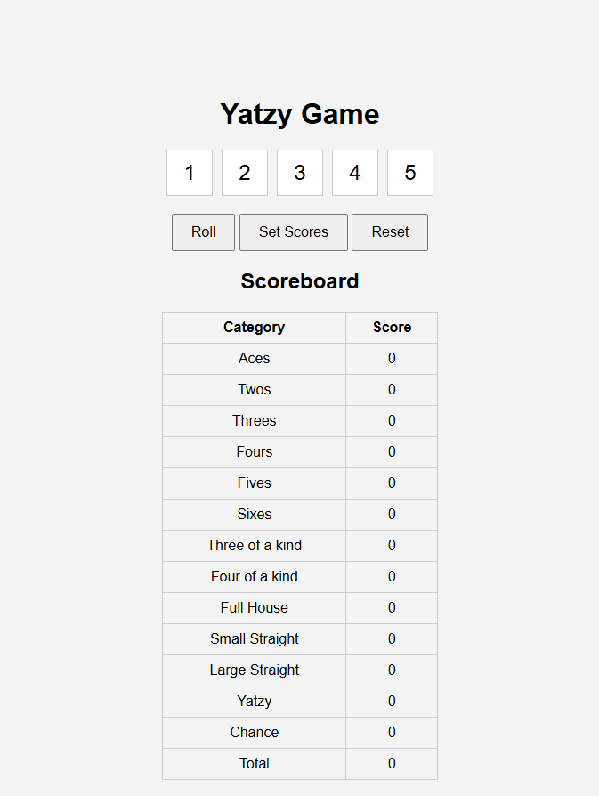
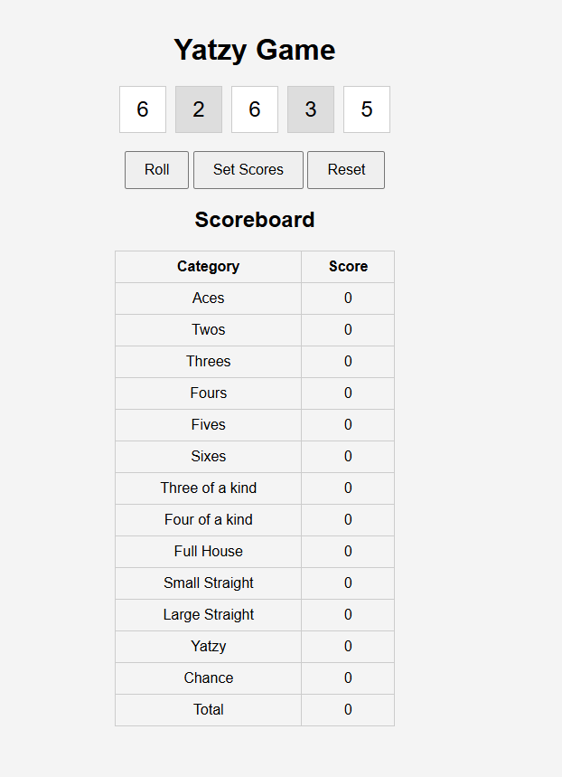
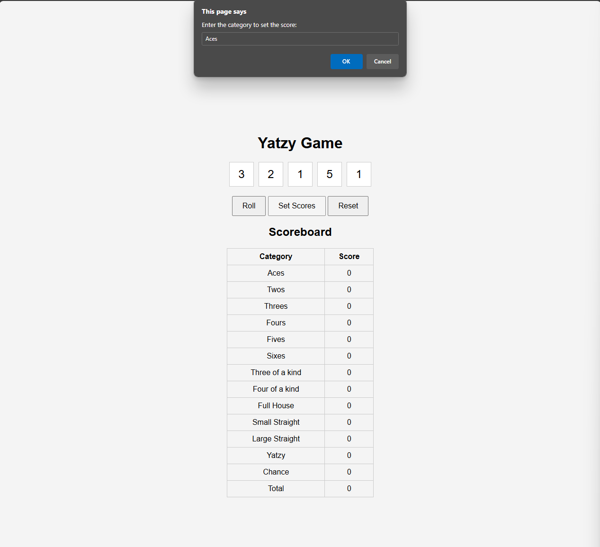
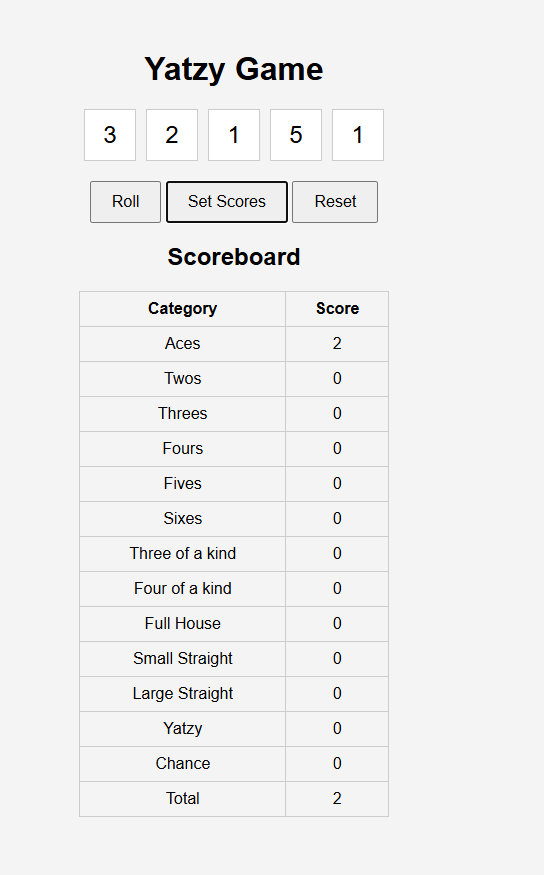

# Game Rules/States:

When the game begins, you're presented with the scoreboard, dice, and buttons for rolling, setting scores, and resetting. 

 

Clicking the roll button randomly assigns values between 1 and 6 to the dice. After each roll, you can select which dice to keep for the next roll by clicking on them. 

You have up to three rolls before clicking the set scores button to assign the dice to a chosen scoring category (e.g., Aces) on the scoreboard, which also updates the total score accordingly. 

Once a category is scored, it remains fixed until the next game. After all the categories are scored (game ends), your total score is displayed on the scoreboard, and clicking reset restarts the game to its initial state.

Design System [Design System](docs/design_system.md)
